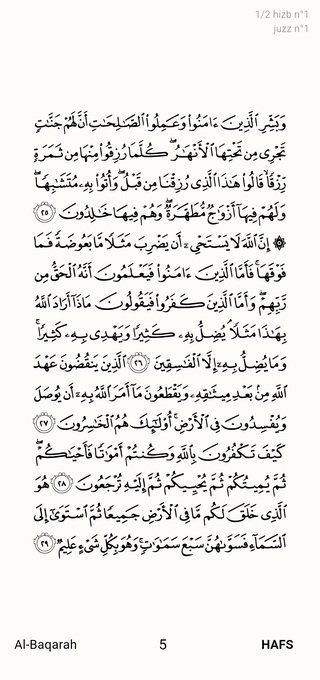
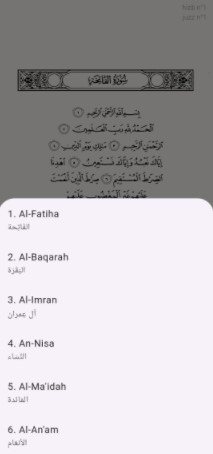

بِسْمِ ٱللَّٰهِ ٱلرَّحْمَٰنِ ٱلرَّحِيمِ

# Coran

**Coran** is a Flutter mobile app that allows users to read the Quran with high-quality Mushaf images in **Hafs** and **Warsh** recitations. The app includes navigation by pages, surah selection, and displays Juz and Hizb information.

---

## Features

- View Quran pages (Hafs and Warsh)
- Navigate by page number or select surah
- Shows Juz and Hizb fractions (1/4, 1/2, 3/4)
- High-quality images from **Quran.com**
- Lightweight SQLite database for ayah information

---

## Screenshots





---

## Technologies

- Flutter
- Dart
- SQLite (sqflite)
- Path Provider
- Android & Windows support

---

## Getting Started

1. Clone the repository:
```bash
git clone https://github.com/sofian-ras/quran_project.git
cd quran
````

2. Install dependencies:

```bash
flutter pub get
```

3. Run the app (Android or Windows):

```bash
flutter run
```

---

## Assets

* Mushaf images are **sourced from Quran.com** – we thank them for their incredible work.
* Fonts and calligraphy included: Hafs, Warsh.
* SQLite database contains ayah information for app navigation.

---

## Notes

* Only Hafs and Warsh recitations are included.
* The app is optimized for Android.

---