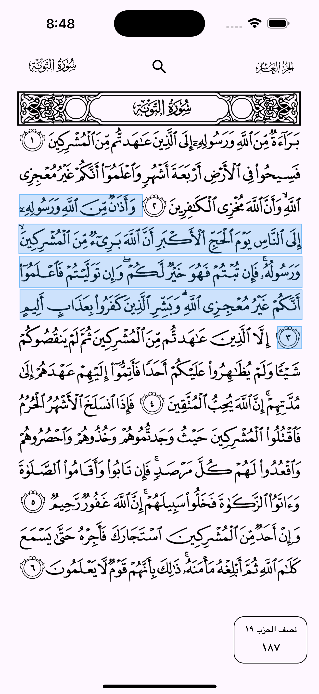
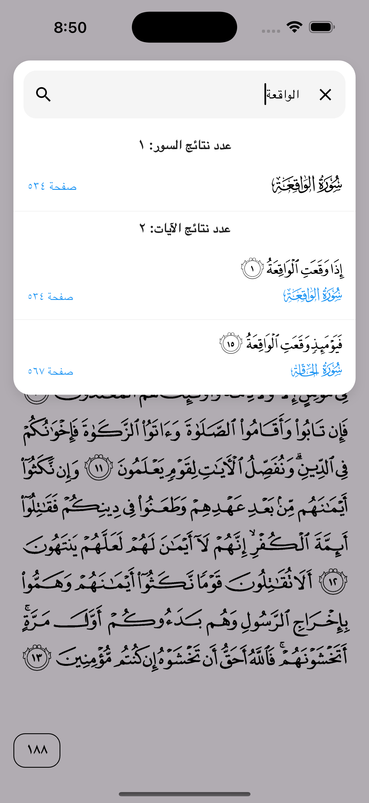
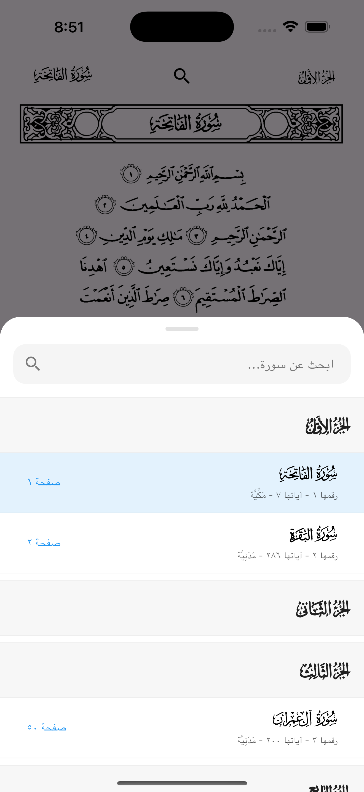

## Support Me

If you enjoy my work and want to support me, you can contribute via [Patreon](https://www.patreon.com/CodeJoint), [PayPal](https://paypal.me/yosfsyd), or [Buy me a coffee](https://www.buymeacoffee.com/youssef_sayed).  
Your support helps me keep creating and improving my projects!

[](https://www.patreon.com/CodeJoint)
[](https://paypal.me/yosfsyd)
[](https://www.buymeacoffee.com/youssef_sayed)

# Quran Pages with Ayah Detector

A Flutter package to display Quran pages (image-based) with tapable/selectable ayahs. This package also includes a modern Search UI and an Assets CLI tool for easy configuration.

## Features

- **Quran Page Rendering**: Display full Quran pages with high-quality images.
- **Ayah Detection**: Tap or long-press on any ayah to get its Surah/Ayah number and highlighted selection.
- **Search Functionality**: A built-in search overlay that allows users to find verses across the entire Quran and navigate directly to them.
- **Customizable UI**: Fully themeable components, including search input, status bar integration (SafeArea), and highlight colors.
- **Assets CLI**: Automated tool to fetch page images and fonts from remote repositories and configure them in `pubspec.yaml`.

## Installation

### 1. Make sure you're using flutter_lints v6

```yaml
dev_dependencies:
  flutter_lints: ^6.0.0
```

### 2. Add to pubspec.yaml

Add the dependency to your `pubspec.yaml`:

```yaml
dependencies:
  quran_pages_with_ayah_detector: ^1.2.0
```

or use

```bash
flutter pub add quran_pages_with_ayah_detector
```

## Setup (Assets CLI)

To fetch the required Quran pages (604 images) and fonts (605 files), use the included CLI tool:

```bash
# Register the CLI
dart pub global activate --source path ./bin

# Run the fetch command
quran_assets_cli fetch-assets --pages-dest assets/pages --fonts-dest assets/fonts -y
```

or

```bash
dart run quran_pages_with_ayah_detector:quran_assets_cli fetch-assets
```

This will:

1. Fetch 604 page images from the official repository.
2. Fetch 605 Quranic fonts.
3. Automatically update your `pubspec.yaml` with all 605 font declarations and asset paths.

## Preview

Should look like that in your project after installing the package & required assets:





## Usage

```dart
import 'package:quran_pages_with_ayah_detector/quran_pages_with_ayah_detector.dart';

// ... inside your widget tree
QuranPageView(
  onAyahTap: (surah, ayah, page) {
    print('Tapped on Surah $surah, Ayah $ayah on Page $page');
  },
  // Customization Examples:
  quranTextColor: Colors.black87,
  topBarTextColor: Colors.blueAccent,
  searchSheetIconsColor: Colors.blueAccent,
  searchFieldHintTextColor: Colors.grey,
  searchFieldTextColor: Colors.black,
  searchFieldHandleColor: Colors.blue,
  searchSheetBackgroundColor: Colors.white,
  searchSheetDarkBackgroundColor: Color(0xFF1E1E1E),
  searchFieldBackgroundColor: Color(0xFFF5F5F5),
  searchFieldDarkBackgroundColor: Color(0xFF2C2C2C),
  searchSheetHeightMultiplier: 0.6, // 60% of screen height
  pageNumberColor: Colors.grey,
  searchResultGroupTitleColor: Colors.black87,
  themeModeAdaption: true, // Automatically adapt colors for Dark/Light mode
  // New in 1.2.0: Ayah Menu & Custom Actions
  customAyahActions: [
    AyahActionOption(
      title: 'إضافة للمفضلة',
      icon: Icons.favorite_border,
      onPress: (surah, ayah, page) {
        print('Ayah Added to Favorites');
      },
    ),
  ],
  // Customize the menu colors
  ayahMenuBackgroundColor: Colors.white,
  ayahMenuTextColor: Colors.black,
  ayahMenuIconColor: Colors.blue,
  themeModeAdaption: true,
)
```

## Features Deep Dive

### Ayah Long-Press Menu

Long-pressing any ayah opens a customizable menu. By default, it includes:

- **Copy Ayah**: Copies the ayah text to the clipboard.
- **Save as Image**: Generates a beautiful image of the ayah with its Surah header.

### Save as Image Feature

This feature generates a `.png` of the selected verse.

**Note for developers:**
If you encounter `MissingPluginException` for `path_provider`, please **perform a full rebuild** of your app (stop and start again) rather than just hot reloading, as this feature requires native plugin linking.

#### Platform Permissions

- **Android**: To save images to the Downloads folder, you may need to add the following to your `AndroidManifest.xml`:
  ```xml
  <uses-permission android:name="android.permission.WRITE_EXTERNAL_STORAGE" />
  ```
  _(Note: For Android 10+, images are saved to the app's document directory if Downloads is inaccessible)._
- **iOS/macOS**: No special permissions are required for saving to the Documents folder, but ensure you have rebuilt the app to link the `path_provider` plugin.

## UI Customization

The `QuranPageView` offers extensive customization options for colors and layout:

| Parameter                            | Default                     | Description                                                                                  |
| ------------------------------------ | --------------------------- | -------------------------------------------------------------------------------------------- |
| `quranTextColor`                     | `Colors.black`              | The color applied to the Quran page images.                                                  |
| `topBarTextColor`                    | `Colors.black`              | Color for Surah and Juz names in the top bar.                                                |
| `pageNumberColor`                    | `Colors.black`              | Color for the page number text at the bottom.                                                |
| `searchSheetIconsColor`              | `Colors.black`              | Color for icons inside the search sheet.                                                     |
| `searchFieldHintTextColor`           | `Colors.grey`               | Hint text color in the search field.                                                         |
| `searchFieldTextColor`               | `Colors.black`              | Input text color in the search field.                                                        |
| `searchFieldHandleColor`             | `Colors.black`              | Cursor and selection handle color.                                                           |
| `searchSheetBackgroundColor`         | `Colors.white`              | Background color for the search sheet (Light).                                               |
| `searchSheetDarkBackgroundColor`     | `Color(0xFF1E1E1E)`         | Background color for the search sheet (Dark).                                                |
| `searchFieldBackgroundColor`         | `Color(0xFFF5F5F5)`         | Background color for the search field (Light).                                               |
| `searchFieldDarkBackgroundColor`     | `Color(0xFF2C2C2C)`         | Background color for the search field (Dark).                                                |
| `searchResultGroupTitleColor`        | `Colors.black87`            | Color for the result count titles in search.                                                 |
| `searchSheetHeightMultiplier`        | `0.4`                       | Max height of the search results sheet (0.0 to 1.0).                                         |
| `themeModeAdaption`                  | `true`                      | If true, colors automatically toggle between black/white or light/dark pairs based on theme. |
| `highlightColor`                     | `Colors.black`              | Color used to highlight the selected ayah.                                                   |
| `pageNumberDesign`                   | `PageNumberDesign.outlined` | Design style for the page number container.                                                  |
| `pageNumberBackgroundColor`          | `null`                      | Background color for page number container (if design supports it).                          |
| `pageNumberBorderColor`              | `null`                      | Border color for page number container.                                                      |
| `pageNumberScrubbingTextColor`       | `Colors.white`              | Text color for the scrubbing overlay.                                                        |
| `pageNumberScrubbingBackgroundColor` | `null`                      | Background color for the scrubbing overlay.                                                  |
| `popupBackgroundColor`               | `null`                      | Background color for the page preview popup.                                                 |
| `popupTextColor`                     | `null`                      | Text color for the page preview popup.                                                       |
| `popupWidth`                         | `null`                      | Custom width for the page preview popup.                                                     |
| `popupHeight`                        | `null`                      | Custom height for the page preview popup.                                                    |
